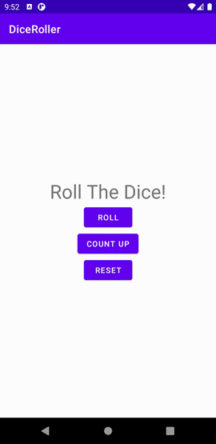

# DiceRoller



## Layout
Quick access to my [layout](app/src/main/res/layout/activity_main.xml).

## Functionality
Quick access to my [MainActivity file](app/src/main/java/com/example/diceroller/MainActivity.kt).

***ROLE** button* function
```kotlin
private fun rollDice() {
    val randomInt = (1..6).random()

    val resultText: TextView = findViewById(R.id.result_text)
    resultText.text = randomInt.toString()
}
```

***COUNT UP** button* function
```kotlin
private fun countUp() {
    val resultText: TextView = findViewById(R.id.result_text)

    if (resultText.text.matches("-?\\d+(\\.\\d+)?".toRegex())) {
        var resultInt = resultText.text.toString().toInt()

        if (resultInt < 6) {
            Toast.makeText(this, "+1",
                Toast.LENGTH_SHORT).show()

            resultInt++
            resultText.text = resultInt.toString()
        } else {
            Toast.makeText(this, "max value",
                Toast.LENGTH_SHORT).show()
        }
    } else {
        Toast.makeText(this, "roll the dice first",
            Toast.LENGTH_SHORT).show()
    }
}
```

***RESET** button* function
```kotlin
private fun resetVal() {
    val resultText: TextView = findViewById(R.id.result_text)

    if (resultText.text.matches("-?\\d+(\\.\\d+)?".toRegex())) {
        resultText.text = "0"
    } else {
        Toast.makeText(this, "roll the dice first",
            Toast.LENGTH_SHORT).show()
    }
}
```

